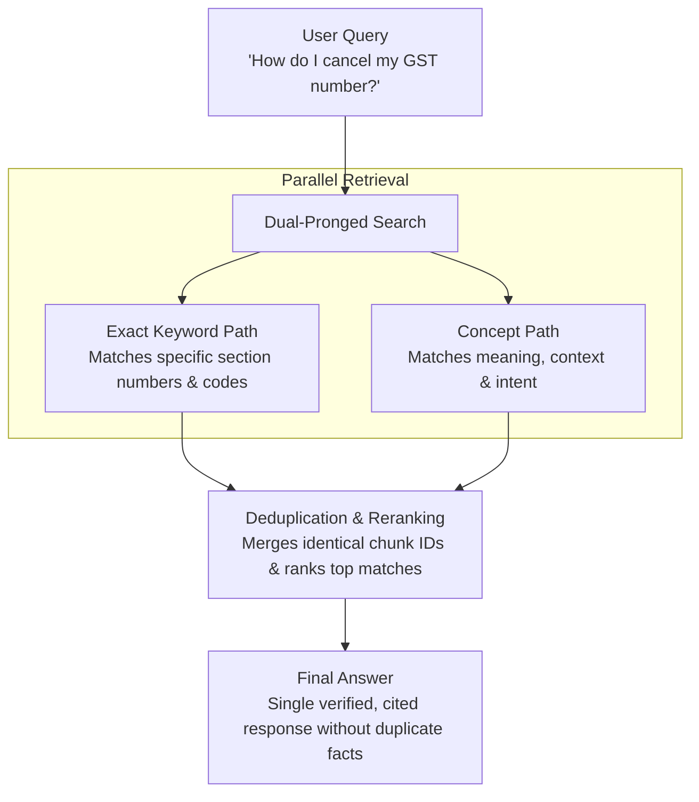

# How the GST AI Assistant Processes Tax Knowledge
### High-Level Operational & Deduplication Strategy

---

### 1. Document Chunking Strategy: Atomic Statutory Units

#### How It Works:
- **Boundary-Aware Partitioning**: Documents are divided strictly at statutory boundaries (Sections, Sub-rules, Forms, and Notification entries), ensuring legal rules are never split from their conditions or provisos.
- **Inherited Provenance Headers**: Every piece of text carries its full legal hierarchy attached at the top:
  > `Central GST Act > Chapter VI: Registration > Section 29: Cancellation of Registration`
- **Preventing Fragmentation**: Large sections use a controlled 60-token overlap boundary only when exceeding token thresholds, ensuring continuous context without redundant repetitions.

#### Concrete Walkthrough Example:
Consider this statutory excerpt spanning two adjacent sections:
> **Section 1. Short title, extent and commencement.**  
> (1) This Act may be called the Goods and Services Tax (Compensation to States) Act, 2017.  
> (2) It extends to the whole of India.  
> (3) It shall come into force on such date as the Central Government may appoint.  
>  
> **Section 2. Definitions.**  
> (1) In this Act, unless the context otherwise requires,-  
> (a) "central tax" means the central goods and services tax levied...  
> (b) "Central Goods and Services Tax Act" means the Central Goods and Services Tax Act, 2017;  
> (c) "cess" means the goods and services tax compensation cess levied under section 8;  
> ...

The system splits this into **exactly 2 separate, self-contained chunks**:

* **Chunk 1 (Section 1)**:
  - **Stored Text**: Prepends `Section 1. Short title, extent and commencement.` followed by subsections (1), (2), and (3) (~65 tokens).
  - **Metadata Attached**: `Section: 1`, `Title: Short title...`, `Act: Compensation Act`.
  - **Boundary Rule**: Closed immediately when `Section 2.` is detected.

* **Chunk 2 (Section 2)**:
  - **Stored Text**: Prepends `Section 2. Definitions.` followed by definition clauses (a) through (f) (~110 tokens).
  - **Metadata Attached**: `Section: 2`, `Title: Definitions`, `Act: Compensation Act`.

**Why this matters**: A naive word-count chunker would have merged the end of Section 1 with the beginning of Section 2. Our chunker keeps them strictly separate so the search engine never confuses definition clauses with commencement dates.

---

### 2. Deduplication Strategy: Fusion & Keyed Uniqueness

To prevent the AI from receiving repeated or conflicting excerpts, the system applies deduplication across two levels:

1. **Retrieval Fusion Deduplication (Chunk-ID Merging)**:
   - The system searches via two parallel paths (exact word matching and conceptual meaning matching).
   - When both paths retrieve the same legal text, the system uses unique Chunk IDs to merge them into a single authoritative candidate, eliminating duplicate reading by the AI.
2. **Tariff Rate & Notification Supersession**:
   - Tariff schedules enforce unique identification on `(HSN/SAC Code, Category, Effective Date)`.
   - When a new government notification modifies an existing rate, the newer effective date supersedes previous records, preventing duplicate or conflicting tax rates.

---

### 3. Concept Mapping Strategy: Intent & Language Alignment

#### How It Works:
- **Intent & Synonym Matching**: Connects conversational taxpayer queries (e.g., *"closing GST number"*) to governing statutory terms (*"cancellation of registration"*).
- **Cross-Language Alignment**: Connects vernacular and Hindi terminology to corresponding English statutory provisions.
- **Full Legal Context**: Captures complete legal provisions without truncation.

---

### 4. Search & Retrieval Flow

---

### 5. Architectural Comparison

| Standard / Naive AI Setup | Our Deduplicated Legal Strategy |
| :--- | :--- |
| Slices text arbitrarily by word count, often duplicating or cutting conditions. | Uses atomic statutory boundaries with inherited legal headers. |
| Delivers repetitive passages if multiple search methods find the same text. | Deduplicates candidates by unique Chunk ID before synthesis. |
| Risks presenting outdated tax rates alongside current rates. | Uses date-keyed supersession so current rates replace older ones. |
| Requires users to guess exact legal jargon. | Maps conversational business questions to official statutory sections. |
