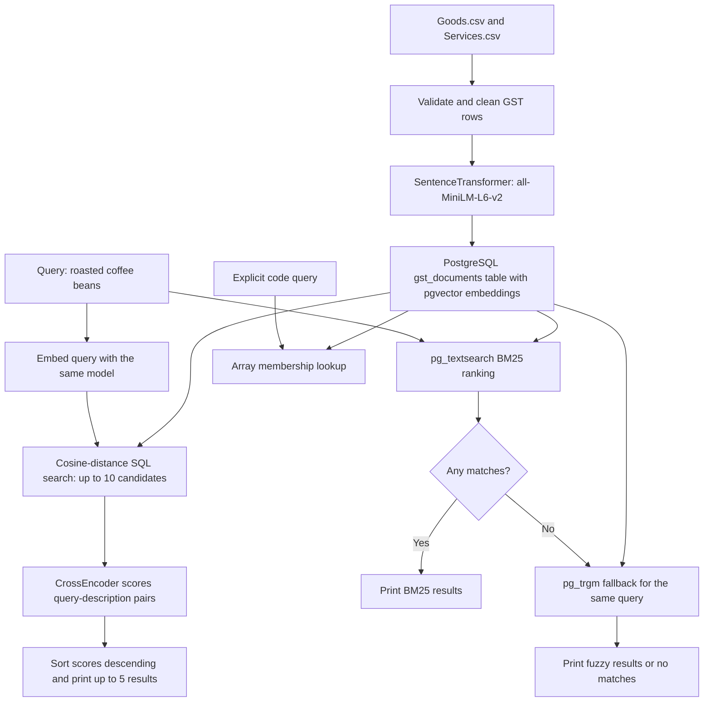

# Project architecture, tools, and techniques

## Purpose and implemented scope

The project demonstrates retrieval over the Kaggle GST goods and services dataset. It combines a semantic retrieval demonstration with a separate keyword search. Keyword search uses Timescale `pg_textsearch` BM25 matching first and character-based fuzzy similarity only when no BM25 rows match. A second model reranks the semantic candidates to improve their ordering for the query.

The downloaded snapshot contains `Goods.csv` (1,850 rows) and `Services.csv` (232 rows). The loader retains 1,729 searchable records after skipping omitted, blank-description, and column-number rows. [Dataset inspection and field mapping](gst-dataset.md) describes all source columns, metadata, percentage conversion, and exact codes.

Semantic retrieval and keyword retrieval run independently for the same input query. The semantic candidates retain the existing cross-encoder reranking stage. There is no RRF, result fusion, or answer-generation stage. Explicit classification lookup is a separate mode that does not load models.

## Data flow

## Tools and technologies

This inventory covers direct dependencies and the infrastructure and model choices explicitly used or declared in the repository. Transitive library versions are not recorded by a lockfile.

| Tool or component | How this project uses it |
| --- | --- |
| Python | Implements CSV ingestion, embedding inference, SQL execution, reranking, and console output in two standalone scripts and a keyword-search module. Standard-library `csv`, `Decimal`, `hashlib`, and `json` handle source parsing, rate conversion, provenance, and reporting; `argparse` exposes the small CLI and `unittest` runs tests. |
| `psycopg[binary]` | PostgreSQL driver; opens connections, executes parameterized SQL, fetches rows, and commits inserted data. The requirement requests its binary distribution option. |
| `pgvector` Python package | Supplies `pgvector.psycopg.register_vector(conn)` so vector values can be adapted through Psycopg. This package is distinct from the database extension. |
| PostgreSQL 17 | Stores codes, descriptions, and embeddings and executes semantic, BM25, fallback, and exact-code queries. JSONB stores source metadata; a GIN array index supports exact code membership. |
| pgvector PostgreSQL extension | Provides the vector column type and the `<=>` cosine-distance operator used for semantic retrieval. |
| Timescale `pg_textsearch` 1.4.0 | Supplies the primary BM25 keyword index and `<@>` scoring operator; requires preloading at server startup. |
| `pg_trgm` PostgreSQL extension | Provides `similarity()` and the `%` threshold operator used only for fallback fuzzy matching. It is required by the search SQL but is not enabled by either script. |
| `sentence-transformers` | Provides the `SentenceTransformer` and `CrossEncoder` model interfaces. |
| `all-MiniLM-L6-v2` | Encodes each description and the semantic query into 384-dimensional dense vectors. |
| `cross-encoder/ms-marco-MiniLM-L-6-v2` | Scores each retrieved query/description pair before the semantic results are reordered. |
| Docker and Docker Compose | Run the database as the `hybrid-rag-db` container using a custom image based on `pgvector/pgvector:pg17`, with host port `5432` and a persistent `pgdata17` volume. `Dockerfile.db` builds the pinned `pg_textsearch` release using Make, a C compiler, and PostgreSQL development headers; curl downloads the release archive. |
| `python-dotenv` | Declared in `requirements.txt`, but not imported or used. `.env.example` is empty. |
| `pip` and Python `venv` | Used in the documented local installation workflow to install dependencies into an isolated environment. |

The code uses local model inference through Sentence Transformers; it does not call an embedding or generation API. Model files may need downloading when first loaded. No explicit device selection, model revision, dependency version pin, or inference tuning is configured.

## Techniques in detail

### 1. Dense embeddings for semantic retrieval

`ingest_gst.py` encodes cleaned descriptions in batches of 32 and stores each vector alongside the GST source record. `test_pgvector.py` delegates to the same loader for compatibility. `search_pgvec.py` encodes the query using the same model, placing queries and descriptions into a comparable vector space.

This permits matching by learned semantic similarity rather than requiring an exact word overlap. A query such as `roasted coffee beans` can be compared to goods descriptions about coffee. This is the intent of the example, not an asserted ranking guarantee.

Each description is whitespace-normalized and passed to the embedding model as one input. Classification codes, rates, and long conditions are excluded from embeddings. There is no chunking or explicit vector normalization; descriptions beyond the model token limit are truncated by the model.

### 2. Cosine-distance nearest-neighbor retrieval

The semantic SQL query computes `embedding <=> query_embedding`, orders by this distance in ascending order, and applies `LIMIT 10`. Lower distance means a closer match under the cosine-distance metric.

The repository defines no vector index. With the minimal schema in the README, this is an exact search over stored vectors, rather than an approximate nearest-neighbor search. HNSW and IVFFlat are not configured. Any indexes created independently in an existing database are outside what the repository records.

### 3. Retrieve, then rerank

After fetching candidates, the script builds `(query, description)` pairs and passes them to `reranker.predict(pairs)`. The cross-encoder evaluates each pair jointly and produces a relevance score. The script converts each score to a Python float, sorts descending, and prints the top five candidates.

This is a two-stage retrieval architecture: embeddings select a small candidate set, then a more detailed pairwise model scores that set. The reranker can change the order of those candidates but cannot recover a document excluded from the initial top 10.

Each printed semantic result includes its code, description, original vector distance, and reranking score. The final order uses only the reranking score. These model scores are not calibrated probabilities or combined with the vector distance.

### 4. BM25 keyword search with trigram fallback

`keyword_search.py` provides `keyword_search(conn, query, limit=5)`, returning `(rows, method)`. Each row contains code, description, method-specific score, three numeric GST rates, and source metadata.

`schema.sql` creates `gst_documents_search_bm25_idx` using Timescale `pg_textsearch`, over description + classification + condition/cess, with English text processing and BM25 parameters `k1=1.2` and `b=0.75`. BM25 ranks keyword relevance using term frequency, corpus-wide term rarity, and document length. English processing handles stemming and stopwords. Documents can match any query term; there is no phrase or Boolean query interface in this application.

`bm25_search` uses `search_text <@> to_bm25query(query, 'gst_documents_search_bm25_idx')`. The explicit index supplies scoring context even for small-table sequential plans. The operator returns negative BM25 scores, so SQL orders ascending and filters to scores below zero. This prevents zero-relevance records from suppressing fallback. Returned scores are negated into positive `bm25_score` values, with higher values representing better matches. Equal-score ordering is unspecified. See the [pinned pg_textsearch documentation](https://github.com/timescale/pg_textsearch/blob/v1.4.0/README.md).

Only if BM25 returns zero relevant rows does the wrapper call `fuzzy_search` with the same query and limit. That function uses `similarity(description, query)` and the `%` threshold operator, ranking descending. The SQL escapes the literal operator as `%%` for Psycopg. Matching uses the entire description and the session's trigram threshold; no trigram index or threshold change is configured by the application.

Partial BM25 results are returned without fuzzy top-up. Blank input returns no rows without accessing the database; nonpositive limits raise `ValueError`. Stopword-only input attempts fallback after finding no BM25 matches. Database errors propagate rather than triggering fallback. BM25 scores and trigram similarities are not combined.

The script accepts GST queries such as `coffee` and the misspelling `cofee`, printing the method that supplied the results. The typo query may still return no rows under the default whole-description trigram threshold. Keyword results remain separate from vector retrieval and cross-encoder reranking.

### 5. Parameterized SQL and transactions

Both scripts pass values separately from SQL using Psycopg placeholders. This covers inserted data, vector queries, keyword query text, and keyword result limits; values are not interpolated into SQL strings.

The loader validates both files before writing and uses `(source_file, source_row)` for upserts. Stale rows belonging to those source files are removed in the same transaction. Both entry points use connection and cursor context managers; failures roll back uncommitted changes. No automatic retry logic is implemented.

### 6. Containerized persistence

Docker Compose supplies a reproducible database service configuration and maps `pgdata17` to `/var/lib/postgresql/data`. The new PostgreSQL 17 volume preserves the initialized database and GST rows across ordinary container restarts and `docker compose down`.

Compose declares database credentials and the database name, but has no schema initialization mount or health check. The server command preloads `pg_textsearch`; database readiness and running `schema.sql` are manual steps in the README. The PostgreSQL 16 to 17 transition uses a new volume and a documented logical backup/restore procedure. Python runs on the host and connects through the mapped port; there is no application container.

## Data model

The GST corpus lives in `gst_documents`, with source filename and CSV row number as its composite primary key. It stores the classification expression, an exact-code array, cleaned description, BM25 search text, three nullable numeric rate columns, original row/provenance JSONB, and a 384-dimensional vector. See [the full schema mapping](gst-dataset.md#schema-and-import-behavior).

The previous `documents` table is left intact but is no longer read or written. `schema.sql` adds the GST table and indexes. Changing the embedding model requires checking vector dimensions and regenerating all GST embeddings in the same vector space.

## Current limitations and unfinished components

- **Hybrid result fusion:** no weighted score combination, reciprocal rank fusion, shared candidate pool, or deduplication across retrieval methods.
- **RAG answer generation:** no generative model, prompt construction, retrieved context assembly, citations, or conversation handling.
- **Data ingestion:** the loader targets these two CSV formats. There is no scheduled dataset synchronization, chunking, or incremental embedding cache.
- **Exact lookup:** ranges, exclusions, malformed classifications, and parent/child code inference are not resolved. Multiple source rows can share a code. Rates and conditions are preserved as dataset content.
- **Evaluation:** Parsing, routing, and optional database integration tests live in `test_ingest_gst.py` and `test_keyword_search.py`. There are no relevance labels, recall/precision measurements, reranker comparisons, or latency benchmarks.
- **Search configuration:** queries, exact codes, input directory, and database URL have CLI options. Model names and semantic candidate/output counts remain in source; keyword retrieval functions expose a `limit` argument.
- **Performance:** `schema.sql` defines BM25 and exact-code array indexes, but no vector or trigram indexes. Embeddings are generated in batches and inserted one row at a time, suitable for this small dataset.
- **Robustness:** empty semantic results are handled before reranking, but model and database failures propagate without retries.
- **Packaging and operations:** no API, UI, application container, CI configuration, lockfile, structured logging, or production deployment configuration is present.

Possible extensions are to combine both retrieval methods for the same query, deduplicate and rerank their candidate pool, add measured retrieval evaluation, and then introduce an answer-generation stage if needed. These are future directions, not implemented behavior.

## Source map

- [GST loader](../ingest_gst.py): CSV validation, rate conversion, embeddings, and transactional upserts.
- [Ingestion tests](../test_ingest_gst.py): parsing and repeat-import checks.
- [Dataset inspection](gst-dataset.md): source columns, schema mapping, and provenance.
- [Search demonstration](../search_pgvec.py): query embedding, cosine-distance retrieval, reranking, and keyword demonstrations.
- [Keyword search](../keyword_search.py): primary BM25 SQL, trigram fallback routing, and exact lookup.
- [Keyword tests](../test_keyword_search.py): routing and PostgreSQL integration checks.
- [Database schema](../schema.sql): extension initialization and the BM25 index.
- [Database image](../Dockerfile.db): PostgreSQL 17, pgvector, and Timescale `pg_textsearch`.
- [Database upgrade](postgresql-upgrade.md): preserve PostgreSQL 16 data when moving to PostgreSQL 17.
- [Database service](../docker-compose.yml): container image, port, credentials, and persistent storage.
- [Python dependencies](../requirements.txt): direct package requirements.
- [Setup and execution](../README.md): local commands, compatible schema initialization, and troubleshooting.
