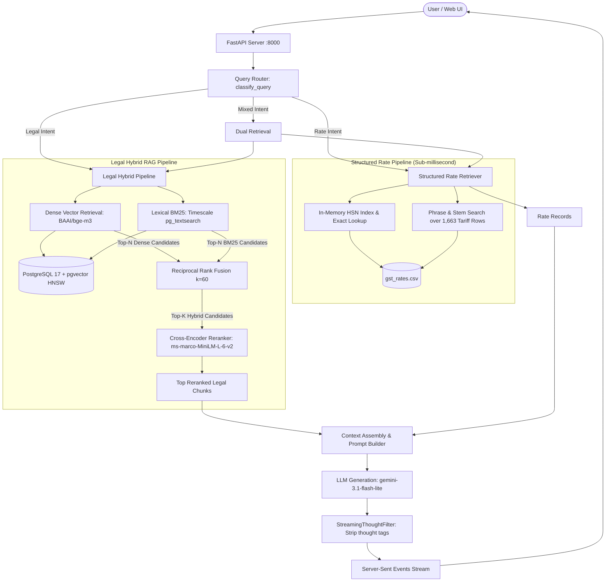

# Technical Architecture, Tech Stack & Query Lifecycl
e Specification

This document provides a comprehensive technical breakdown of the GST Assistant and Retrieval Inspector system. It details every component of the technology stack—from underlying machine learning models and database extensions down to runtime libraries—explaining the engineering rationale for each choice, followed by a step-by-step trace of how queries are routed, retrieved, fused, reranked, and generated.

---

## 1. High-Level System Architecture

The system is a production-grade **Hybrid Retrieval-Augmented Generation (RAG)** engine tailored for Indian Goods and Services Tax (GST) laws, procedures, rules, forms, and tariff rates.

The architecture solves two fundamentally distinct retrieval problems:
1. **Statutory Legal RAG (Acts, Rules, Forms, Procedures)**: Unstructured and semi-structured legal text where taxpayers require grounded legal reasoning, exact section/rule citations, and procedural clarity.
2. **Structured Tariff Rate Retrieval (HSN/SAC Codes & Rates)**: Highly structured, exact tariff tables where users require deterministic rates (CGST, SGST, IGST, Compensation Cess), strict date integrity, and exact exemption statuses without mathematical errors or hallucinations.



---

## 2. Complete Tech Stack & Component Rationales

### 2.1 Machine Learning & NLP Models

| Component | Model / Technology | Parameters / Specifications | Technical Rationale & Role |
| :--- | :--- | :--- | :--- |
| **Dense Embedding Model** | **`BAAI/bge-m3`** | • Dimension: `1024`<br>• Max Context: `8,192` tokens<br>• Multi-lingual (100+ languages)<br>• Dense representations | **Why chosen over standard embedding models (e.g., MiniLM, OpenAI text-embedding-3):**<br>1. **Multi-lingual & Bilingual Competence**: Indian GST statutory documents (especially registration, refund, and appeal forms) contain extensive bilingual Hindi and English terminology. BGE-M3 exhibits superior cross-lingual semantic alignment.<br>2. **Extended Context Window (8,192 tokens)**: Unlike standard 512-token models (`all-MiniLM-L6-v2`), BGE-M3 can encode entire legal statutory subsections and schedule conditions without truncation.<br>3. **1024-Dimensional Semantic Richness**: Encodes dense legal nuances and domain-specific terminology (such as *"input tax credit reversal"*, *"composition levy"*, *"revocation of cancellation"*). |
| **Cross-Encoder Reranker** | **`cross-encoder/ms-marco-MiniLM-L-6-v2`** (and BAAI BGE rerankers) | • Joint cross-attention<br>• Input: `[CLS] Query [SEP] Passage [SEP]`<br>• Output: Unbounded logit relevance score | **Why chosen over bi-encoder similarity alone:**<br>1. **Cross-Attention Interaction**: Bi-encoders encode queries and passages into single independent vectors, losing inter-token interactions. A cross-encoder performs all-to-all attention across query tokens and document tokens simultaneously.<br>2. **Eliminates False Positives**: Filters out passages that share similar keywords but differ in legal meaning (e.g., distinguishing conditions under *Section 29* for cancellation vs *Section 30* for revocation). |
| **Generative LLM** | **`gemini-3.1-flash-lite`** (via Google Generative Language OpenAI Compatibility API) | • Context Window: `1,000,000+` tokens<br>• Low-latency inference<br>• High instruction compliance<br>• Temperature: `0.1` | **Why chosen:**<br>1. **Strict Context Grounding**: Follows negative constraints flawlessly (e.g., *"Never invent missing fields"*, *"Never label notification dates as effective dates"*).<br>2. **Near-Zero Latency**: Extremely fast time-to-first-token, essential for interactive streaming chatbots.<br>3. **Cost-Effective Scalability**: Optimized for high-throughput query answering. |

---

### 2.2 Database, Extensions & Storage Layer

| Component | Technology | Role & Engineering Rationale |
| :--- | :--- | :--- |
| **Relational Database** | **PostgreSQL 17** | Provides reliable ACID storage, JSONB document querying, enterprise index types, and extensibility. Serves as the single unified persistence engine for metadata, text chunks, and vectors. |
| **Vector Extension** | **`pgvector` (v0.8.0+)** | Adds native vector types and distance operators (`<=>` cosine distance, `<->` L2 distance, `<#>` inner product). Facilitates fast similarity queries directly in SQL without needing a separate standalone vector database (e.g., Pinecone/Milvus), keeping vector embeddings and relational metadata transactionally unified. |
| **Vector Indexing** | **HNSW (`hierarchical navigable small world`)** | Constructed with `m=16, ef_construction=64` over 1024-dimensional BGE-M3 embeddings. Provides sub-millisecond approximate nearest neighbor (ANN) retrieval with logarithmic search complexity, outperforming IVFFlat in recall and query latency. |
| **Lexical Search Extension** | **Timescale `pg_textsearch` 1.4.0 / ParadeDB `pg_search`** | Implements the industry-standard Okapi BM25 ranking algorithm natively inside PostgreSQL (`<@>` scoring operator, `k1=1.2, b=0.75`). Standard PostgreSQL full-text search (`to_tsvector`/`tsquery`) only counts term frequencies; BM25 balances term frequency, corpus-wide inverse document frequency (IDF), and document length normalization. |
| **Fuzzy Text Fallback** | **`pg_trgm`** | Supplies trigram similarity (`similarity()`, `%` operator). Used as a secondary fallback mechanism for typos and misspellings when exact BM25 matches yield zero candidates. |
| **Database Driver** | **`psycopg` 3.x (`[binary]`)** | Modern, high-performance PostgreSQL client library for Python. Supports binary protocol data exchange, client-side connection parameters, parameterized SQL preventing injection, and native vector conversion via `pgvector.psycopg.register_vector(conn)`. |
| **Containerization** | **Docker & Docker Compose** | Multi-stage build (`Dockerfile.db`) compiling pinned PostgreSQL 17 with pgvector and Timescale `pg_textsearch` extensions from C source headers. Mounts persistent volume `pgdata17` to guarantee data durability. |

---

### 2.3 Backend & Application Frameworks

| Component | Library / Framework | Role & Engineering Rationale |
| :--- | :--- | :--- |
| **Web API Framework** | **FastAPI 0.115+** | High-performance asynchronous Python web framework built on Starlette and Pydantic. Provides automatic OpenAPI docs, CORS middleware, and dependency injection. |
| **Model Preloading Lifespan** | **FastAPI `lifespan` handler** | Pre-loads heavy PyTorch SentenceTransformer and CrossEncoder models once at server startup into memory (`app.state.models`). Avoids 3–8 second model initialization delays during live user queries. |
| **Web Server (ASGI)** | **Uvicorn 0.34+** | Production ASGI server running asynchronous event loops for concurrent request handling. |
| **Data Validation** | **Pydantic v2** | Validates incoming payloads (`ChatRequest`, `SearchRequest`, `RateSearchRequest`), verifying positive integer ranges (`top_k`, `limit`) and non-empty strings. |
| **Real-Time Streaming** | **Server-Sent Events (`StreamingResponse`)** | Emits JSON chunks with event types (`meta`, `token`, `done`, `error`) over an open HTTP connection (`text/event-stream`), enabling typewriter-style live token generation in the browser. |
| **Thought Tag Filter** | **`StreamingThoughtFilter`** | Custom stateful streaming buffer. Intercepts and suppresses `<thought>...</thought>` or `<thinking>...</thinking>` reasoning tokens generated by thinking models, preventing internal scratchpads from leaking to users. |
| **Configuration** | **`python-dotenv`** | Securely loads environment variables (`HF_TOKEN`, `OPENAI_API_KEY`, `OPENAI_BASE_URL`, `OPENAI_MODEL`, `DATABASE_URL`) from `.env`. |

---

### 2.4 Data Parsing, Chunking & Retrieval Utilities

| Component | Library / Module | Role & Engineering Rationale |
| :--- | :--- | :--- |
| **PDF Extraction** | **PyMuPDF (`fitz`) 1.25+** | Lightning-fast PDF parsing library written in C. Extracts text, structural fonts, and tables from the 94-page GST Rates notification PDF and legislative Acts/Rules documents. |
| **Structure-Aware Chunkers** | **`act_chunker.py`, `rules_chunker.py`, `form_chunker.py`** | **Why not naive fixed-character/token chunking?**<br>Arbitrary token slicing splits legal sentences across subsection boundaries, destroying statutory provisos and conditions. Custom chunkers split strictly along legal boundaries: Sections, Subsections, Chapters, Rules, Sub-rules, and Form tables, attaching parent statutory headers to every chunk. |
| **Structured Rate Retriever** | **`src/retrievers/rate_retriever.py`** | Performs exact and fuzzy HSN tariff lookups over `gst_rates.csv` (1,663 records). Builds an in-memory normalized digit hash index (`2`, `4`, `6`, `8` digits) providing **sub-millisecond lookups** without incurring embedding, database, or LLM overhead. |
| **Rank Fusion** | **Reciprocal Rank Fusion (`rrf.py`)** | Merges ranked lists from disparate retrieval systems (dense vector cosine distance and sparse lexical BM25 scores) using the formula: $RRF\_score(d) = \sum_{m \in M} \frac{1}{k + r_m(d)}$ with smoothing constant $k=60$. Requires no score normalization or calibration across different metric spaces. |

---

### 2.5 Frontend Stack

| Component | Technology | Role & Engineering Rationale |
| :--- | :--- | :--- |
| **Frontend Framework** | **React 18 (Standalone Babel)** | Single-page application loaded directly in the browser via CDN without heavy Node.js/Webpack build steps. |
| **Interactive Inspector** | **Retrieval Debug Drawer** | Renders intermediate stage tabs: **Hybrid + Reranker**, **Hybrid (RRF)**, **Dense (pgvector)**, and **BM25**, exposing candidate scores, ranks, and stage latency in milliseconds. |
| **Markdown Renderer** | Custom lightweight regex parser | Renders headings, lists, bold text, and code blocks safely without external npm vulnerabilities. |

---

## 3. End-to-End Technical Execution Lifecycle

When a user submits a query to the GST bot, the system executes through the following distinct stages:

```
[User Query]
     │
     ▼
[Stage 1: Intent Routing] ────► RATE / LEGAL / MIXED
     │
     ├────────────────────────┬────────────────────────┐
     ▼                        ▼                        ▼
[Stage 2A: Rate Path]   [Stage 2B: Legal Path]   [Mixed Path]
(Exact HSN + Stemming)   (BGE-M3 + BM25 + RRF)   (Runs Both)
     │                        │                        │
     └────────────────────────┴────────────────────────┘
     │
     ▼
[Stage 3: Context Assembly & Prompt Construction]
     │
     ▼
[Stage 4: LLM Generation & Live Token Streaming]
     │
     ▼
[Stage 5: Client Display via SSE & Source Citations]
```

---

### Stage 1: Query Ingestion & Route Classification
**File:** [`src/routers/query_router.py`](file:///home/scalp-9/hybrid-rag-poc/src/routers/query_router.py)

1. The query arrives at `POST /chat` or `POST /chat/stream`.
2. `classify_query(query)` evaluates the query using regular expressions:
   - **Rate Intent (`has_rate_intent`)**: Looks for HSN/SAC mentions, tariff chapter headings, rate percentages (`%`, `gst rate`, `cgst`, `sgst`, `igst`, `cess`), standalone 4–8 digit codes, or product rate queries (`"What is the GST on butter?"`, `"Give me full GST details for fresh milk"`).
   - **Legal Intent (`has_legal_intent`)**: Looks for statutory terms (*"section"*, *"rule"*, *"form"*, *"cancellation"*, *"revocation"*, *"penalty"*, *"procedure"*, *"appeal"*, *"input tax credit"*).
3. Query Route assignment:
   - Matches only rate intent $\rightarrow$ `RouteType.RATE`
   - Matches only legal intent $\rightarrow$ `RouteType.LEGAL`
   - Matches both $\rightarrow$ `RouteType.MIXED` (e.g., *"GST rate on footwear and procedure for cancellation under Rule 22"*)

---

### Stage 2A: Structured Rate Retrieval (for RATE & MIXED)
**File:** [`src/retrievers/rate_retriever.py`](file:///home/scalp-9/hybrid-rag-poc/src/retrievers/rate_retriever.py)

1. **Code Extraction**: `extract_query_codes(query)` isolates 2, 4, 6, or 8-digit HSN codes (e.g., `"0405"` for butter, `"8711"` for motorcycles).
2. **Exact Index Lookup**: `exact_code_lookup(code)` queries the pre-computed in-memory hash index mapping normalized digit strings to CSV row positions.
3. **Natural Language Search**: If no HSN code was given or candidate limits allow, `extract_search_phrase(query)` strips query boilerplate (*"What is the GST rate on"*, *"Give me full details for"*) and searches `description` using word stems, prefix weighting, and exclusion clause penalties (`other than ...`).
4. **Data Categorization & Safe Derivations**:
   - `CGST` $\rightarrow$ derives `cgst_rate = source_rate`, `sgst_rate = source_rate`, `total_gst_rate = source_rate * 2`.
   - `EXEMPTION` $\rightarrow$ preserves `source_rate` (`Nil`), sets `is_exempt = true`, `total_gst_rate = 0%`, never doubles.
   - `COMPENSATION_CESS` $\rightarrow$ preserves cess rate independently, base rates remain `null`, never doubles.
   - `SPECIAL` $\rightarrow$ conditional concessions (e.g. 3% without ITC under Notif 02/2022) preserved without automatic doubling.

---

### Stage 2B: Legal Hybrid Retrieval & Reranking (for LEGAL & MIXED)
**Files:** [`src/retrieval_inspector.py`](file:///home/scalp-9/hybrid-rag-poc/src/retrieval_inspector.py), [`src/retrievers/legal_dense_retriever.py`](file:///home/scalp-9/hybrid-rag-poc/src/retrievers/legal_dense_retriever.py), [`src/retrievers/bm25_retriever.py`](file:///home/scalp-9/hybrid-rag-poc/src/retrievers/bm25_retriever.py), [`src/retrievers/legal_hybrid_retriever.py`](file:///home/scalp-9/hybrid-rag-poc/src/retrievers/legal_hybrid_retriever.py)

1. **Dense Vector Retrieval**:
   - The query text is encoded using the pre-loaded `BAAI/bge-m3` model via `embed_query()`, outputting a unit-normalized 1,024-dimensional float vector.
   - Executes an SQL query against PostgreSQL:
     ```sql
     SELECT chunk_id, document_type, reference, title, content, 
            (embedding <=> %(query_embedding)s) AS distance
     FROM act_chunks
     ORDER BY distance ASC
     LIMIT 30;
     ```
   - Searches `act_chunks`, `rule_chunks`, and `form_chunks` using HNSW index navigation, returning top 30 dense candidates.
2. **Sparse BM25 Retrieval**:
   - Simultaneously, `BM25Retriever.retrieve()` runs a native full-text BM25 search via Timescale `pg_textsearch`:
     ```sql
     SELECT chunk_id, document_type, reference, title, content,
            (search_text <@> to_bm25query(%(query)s, 'act_chunks_bm25_idx')) AS bm25_score
     FROM act_chunks
     WHERE search_text <@> to_bm25query(%(query)s, 'act_chunks_bm25_idx') < 0
     ORDER BY bm25_score ASC
     LIMIT 30;
     ```
   - Returns top 30 lexical candidates.
3. **Reciprocal Rank Fusion (RRF)**:
   - `fuse_legal_results()` merges the dense list and BM25 list by stable `chunk_id`.
   - Computes rank score:
     $$RRF\_score(d) = \sum_{m \in \{dense, bm25\}} \frac{1}{60 + rank_m(d)}$$
   - Combines scores for documents appearing in both candidate lists. Yields the top 30 fused hybrid candidates.
4. **Cross-Encoder Reranking**:
   - `rerank_legal_results()` constructs candidate pairs: `[[query, candidate_1_text], [query, candidate_2_text], ...]`.
   - Evaluates them through `cross-encoder/ms-marco-MiniLM-L-6-v2`.
   - Sorts candidates by cross-encoder logit scores descending and trims to final `top_k` (default: 5).

---

### Stage 3: Context Assembly & Prompt Construction
**File:** [`src/generators/answer_generator.py`](file:///home/scalp-9/hybrid-rag-poc/src/generators/answer_generator.py)

1. The system formats retrieved records into structured Markdown blocks:
   - If rate records exist: `STRUCTURED GST RATE RECORDS` block with Tariff codes, full legal descriptions, notification details, dates, and schedules.
   - If legal chunks exist: `RETRIEVED LEGAL CONTEXT` block with Document Type, Reference (e.g., *"Section 29"*), Title, Chunk ID, and Content.
2. Combines context with the grounded `SYSTEM_PROMPT`. The prompt strictly enforces:
   - **Direct Answer First**: The first sentence must be a human-style answer.
   - **Exemptions**: Explicitly state that the product is exempt (0% GST).
   - **Taxable Goods**: State the total GST rate and intra-state breakdown (CGST + SGST).
   - **Cess**: Show Compensation Cess separately; never add cess into total GST.
   - **Description**: Full retrieved statutory descriptions must be shown verbatim.
   - **Date Integrity**: Notification dates are strictly labeled *"Notification Date"*, never *"Effective Date"*.

---

### Stage 4: Generation, Streaming & Thought Filtering
**File:** [`src/generators/answer_generator.py`](file:///home/scalp-9/hybrid-rag-poc/src/generators/answer_generator.py)

1. Dispatches the prompt to `client.chat.completions.create(model="gemini-3.1-flash-lite", temperature=0.1, stream=True)`.
2. As token deltas arrive from the LLM, they pass through `StreamingThoughtFilter`:
   - Buffers partial tokens to detect opening `<thought>` or `<thinking>` tags.
   - Silently consumes internal reasoning tokens until closing `</thought>` tags.
   - Flushes only clean, final answer tokens to the client stream.
3. Emits Server-Sent Events (SSE):
   - `type: "meta"`: Contains query route, candidate records, citations, and retrieval timings.
   - `type: "token"`: Yields individual text tokens in real time.
   - `type: "done"`: Final completed response string and end-to-end latency metrics.

---

## 4. Architectural Summary

| Layer | Implementation | Key Advantage |
| :--- | :--- | :--- |
| **Ingestion** | Structure-aware legal chunkers + PyMuPDF | Retains provisos, sub-rules, and statutory context intact |
| **Embeddings** | `BAAI/bge-m3` (1024d) | Handles long legal contexts and English/Hindi bilingualism |
| **Vector DB** | PostgreSQL 17 + `pgvector` HNSW | Zero data divergence between metadata and vectors; sub-ms ANN |
| **Lexical Search** | Timescale `pg_textsearch` (BM25) | Native BM25 term frequency/IDF ranking |
| **Hybrid Fusion** | Reciprocal Rank Fusion ($k=60$) | Robust multi-modal ranking without manual score normalization |
| **Reranking** | Cross-Encoder (`ms-marco-MiniLM-L-6-v2`) | Deep token-level cross-attention eliminates false positives |
| **Rate Retrieval** | In-Memory Hash Index over `gst_rates.csv` | Sub-millisecond deterministic tariff lookups with zero hallucination |
| **Generation** | `gemini-3.1-flash-lite` via OpenAI API Client | Low latency, strict instruction following, grounded citations |
| **Streaming UI** | FastAPI SSE + React 18 + Thought Filter | Transparent RAG inspection with instantaneous typewriter feedback |
