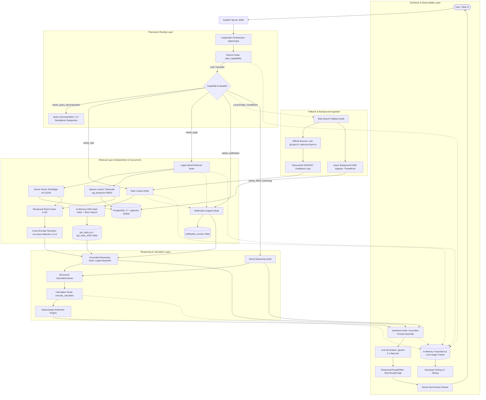

# Technical Architecture, Tech Stack & Query Lifecycle Specification

This document provides an exhaustive, production-grade technical specification of the **GST Assistant and Retrieval Inspector** system. It details every component of the technology stack—from underlying machine learning models and database extensions down to runtime libraries and agentic graph orchestration—explaining the engineering rationale for each choice, followed by a step-by-step trace of how queries are planned, decomposed, retrieved, fused, reranked, reasoned over, computed, and generated.

---

## 1. High-Level System Architecture

The system is an enterprise-grade **Multi-Capability Hybrid Retrieval-Augmented Generation (RAG) and Deterministic Reasoning Engine** tailored specifically for Indian Goods and Services Tax (GST) laws, procedures, rules, forms, rate notifications, and tariff schedules.

The architecture solves five fundamentally distinct computational and retrieval problems:
1. **Statutory Legal RAG (Acts, Rules, Forms, Procedures)**: Unstructured and semi-structured legislative text where taxpayers require grounded legal reasoning, exact section/rule citations, procedural clarity, and strict adherence to statutory conditions.
2. **Structured Tariff Rate Retrieval (HSN/SAC Codes & Rates)**: Highly structured, exact tariff schedules where users require deterministic rates (CGST, SGST, IGST, Compensation Cess), strict date integrity, and exact exemption statuses without mathematical errors or hallucinations.
3. **Amending Gazette Notification Tracking**: Vector retrieval and metadata boosting over amending notifications (e.g., Central Tax Rate notifications from 2025) to capture real-time rate amendments, condition changes, and effective dates.
4. **Deterministic Arithmetic & Ledger Utilization**: Pure mathematical computation for invoice calculations, discount adjustments, and Input Tax Credit (ITC) cross-utilization under Section 49 and Rule 88A without relying on probabilistic LLM arithmetic.
5. **Authoritative Fallback Web Search & Real-Time Background Knowledge Ingestion**: Self-healing retrieval when local knowledge sources lack an unindexed commodity or service (e.g., SAC 9963 restaurant services), immediately answering the user and asynchronously classifying, normalizing, embedding, and inserting verified facts into local knowledge stores with zero response latency.



---

## 2. Complete Tech Stack & Component Rationales

### 2.1 Machine Learning & NLP Models

| Component | Model / Technology | Parameters / Specifications | Technical Rationale & Role |
| :--- | :--- | :--- | :--- |
| **Dense Embedding Model** | **`BAAI/bge-m3`** | • Dimension: `1024`<br>• Max Context: `8,192` tokens<br>• Multi-lingual (100+ languages)<br>• Normalized dense vectors | **Why chosen over standard embedding models (e.g., MiniLM, OpenAI text-embedding-3):**<br>1. **Multi-lingual & Bilingual Competence**: Indian GST statutory documents (especially registration, refund, and appeal forms) contain extensive bilingual Hindi and English terminology. BGE-M3 exhibits superior cross-lingual semantic alignment.<br>2. **Extended Context Window (8,192 tokens)**: Unlike standard 512-token models (`all-MiniLM-L6-v2`), BGE-M3 can encode entire statutory subsections, schedule conditions, and complex notifications without truncation.<br>3. **1024-Dimensional Semantic Richness**: Encodes dense legal nuances and domain-specific terminology (such as *"input tax credit reversal"*, *"composition levy"*, *"revocation of cancellation"*, *"inverted duty structure"*). |
| **Cross-Encoder Reranker** | **`cross-encoder/ms-marco-MiniLM-L-6-v2`** | • Joint cross-attention<br>• Input: `[CLS] Query [SEP] Passage [SEP]`<br>• Output: Unbounded logit relevance score | **Why chosen over bi-encoder similarity alone:**<br>1. **Cross-Attention Interaction**: Bi-encoders encode queries and passages into independent vectors, losing token-to-token interactions. The cross-encoder performs all-to-all attention across query tokens and document tokens simultaneously.<br>2. **Eliminates False Positives**: Distinguishes passages with overlapping vocabulary but divergent legal meanings (e.g., distinguishing grounds for cancellation under *Section 29* from application for revocation under *Section 30*). |
| **Generative LLM** | **`gemini-3.1-flash-lite`** (default via Google Generative Language OpenAI Compatibility API) | • Context Window: `1,000,000+` tokens<br>• Low-latency inference<br>• High instruction compliance<br>• Temperature: `0.1` (or `0.0` for planner) | **Why chosen:**<br>1. **Strict Context Grounding**: Follows negative constraints reliably (e.g., *"Never invent missing fields"*, *"Never label notification dates as effective dates"*, *"Never invent Section or Rule numbers"*).<br>2. **Near-Zero Latency**: Extremely fast time-to-first-token, essential for interactive streaming chatbots.<br>3. **Cost-Effective Scalability**: High throughput at low cost per million tokens ($0.0375 input / $0.15 output). Supported alternate models include `gpt-4o-mini` and `gpt-4o`. |

---

### 2.2 Database, Extensions & Storage Layer

| Component | Technology | Role & Engineering Rationale |
| :--- | :--- | :--- |
| **Relational Database** | **PostgreSQL 17** | Provides ACID transactional storage, JSONB document querying, enterprise index types, and extensibility. Serves as the single unified persistence engine for metadata, text chunks, and vectors. |
| **Vector Extension** | **`pgvector` (v0.8.0+)** | Adds native vector types and distance operators (`<=>` cosine distance, `<->` L2 distance, `<#>` inner product). Facilitates similarity queries directly in SQL without needing a separate standalone vector database (e.g., Pinecone/Milvus), keeping vector embeddings and relational metadata transactionally unified. |
| **Vector Indexing** | **HNSW (`hierarchical navigable small world`)** | Constructed with `m=16, ef_construction=64` over 1024-dimensional BGE-M3 embeddings across `act_chunks`, `rule_chunks`, `form_chunks`, and `notification_chunks`. Provides sub-millisecond approximate nearest neighbor (ANN) retrieval with logarithmic search complexity, outperforming IVFFlat in recall and latency. |
| **Lexical Search Extension** | **Timescale `pg_textsearch` 1.4.0 / ParadeDB `pg_search`** | Implements the industry-standard Okapi BM25 ranking algorithm natively inside PostgreSQL (`<@>` scoring operator, `k1=1.2, b=0.75`). Standard PostgreSQL full-text search (`to_tsvector`/`tsquery`) only counts term frequencies; BM25 balances term frequency, corpus-wide inverse document frequency (IDF), and document length normalization. |
| **Fuzzy Text Fallback** | **`pg_trgm`** | Supplies trigram similarity (`similarity()`, `%` operator). Used as a secondary fallback mechanism for typos and misspellings when exact BM25 matches yield zero candidates. |
| **Database Driver** | **`psycopg` 3.x (`[binary]`)** | Modern, high-performance PostgreSQL client library for Python. Supports binary protocol data exchange, client-side connection parameters, parameterized SQL preventing injection, and native vector conversion via `pgvector.psycopg.register_vector(conn)`. |
| **Containerization** | **Docker & Docker Compose** | Multi-stage build (`Dockerfile.db`) compiling pinned PostgreSQL 17 with pgvector and Timescale `pg_textsearch` extensions from C source headers. Mounts persistent volume `pgdata17` to guarantee data durability. |

---

### 2.3 Backend & Application Frameworks

| Component | Library / Framework | Role & Engineering Rationale |
| :--- | :--- | :--- |
| **Web API Framework** | **FastAPI 0.115+** | High-performance asynchronous Python web framework built on Starlette and Pydantic. Provides automatic OpenAPI documentation, CORS middleware, and dependency injection. |
| **Workflow Orchestration** | **LangGraph 0.2+** | Directs multi-capability graph execution via `StateGraph(GSTGraphState)`. Supports dynamic branching, capability fan-out, dependency ordering (retrieval before calculation/synthesis), and state persistence via checkpointer (`MemorySaver`). |
| **Conversation Memory** | **LangGraph `MemorySaver`** | Maintains multi-turn conversation state per `thread_id`. Stores user and assistant dialogue turns, resolving follow-up pronouns (e.g., *"What if I buy 2 of them?"* resolving to previous product) and cumulative premise values. |
| **Model Preloading Lifespan** | **FastAPI `lifespan` handler** | Pre-loads heavy PyTorch SentenceTransformer and CrossEncoder models once at server startup into memory (`app.state.models`). Avoids 3–8 second model initialization delays during live user queries. |
| **Web Server (ASGI)** | **Uvicorn 0.34+** | Production ASGI server running asynchronous event loops for concurrent request handling. |
| **Data Validation** | **Pydantic v2** | Validates incoming payloads (`ChatRequest`, `SearchRequest`, `RateSearchRequest`), Pydantic models for structured planner outputs (`GSTPlan`), calculation inputs (`CalculationInputs`), and calculation results (`CalculationResult`). |
| **Real-Time Streaming** | **Server-Sent Events (`StreamingResponse`)** | Emits JSON events (`meta`, `token`, `done`, `error`) over an open HTTP connection (`text/event-stream`), enabling typewriter-style live token generation in the browser. |
| **Thought Tag Filter** | **`StreamingThoughtFilter`** | Custom stateful streaming buffer. Intercepts and suppresses `<thought>...</thought>` or `<thinking>...</thinking>` reasoning tokens generated by thinking models, preventing internal scratchpads from leaking to users. |
| **Observability & Tracing** | **`trace_store.py` & `llm_usage_tracker.py`** | In-memory bounded store recording end-to-end execution traces by UUID: planner flags, node execution sequence, retrieval candidate stages, calculation inputs, synthesis timing, token counts, and real-time USD cost estimation. |

---

### 2.4 Data Parsing, Chunking & Retrieval Utilities

| Component | Library / Module | Role & Engineering Rationale |
| :--- | :--- | :--- |
| **PDF Extraction** | **PyMuPDF (`fitz`) 1.25+** | Lightning-fast PDF parsing library written in C. Extracts text, structural fonts, and tables from the 94-page GST Rates notification PDF, Central/Integrated Acts, CGST Rules, and Form compilations. |
| **Structure-Aware Chunkers** | **`act_chunker.py`, `rules_chunker.py`, `forms_chunker.py`, `notification_chunker.py`** | Splits legal documents strictly along statutory boundaries (Sections, Subsections, Rules, Sub-rules, Forms, Notification Schedule entries) while prepending parent context headers. Caps chunks at ~450 tokens with 60-token overlap. |
| **Structured Rate Retriever** | **`src/retrievers/rate_retriever.py`** | Performs exact and fuzzy HSN tariff lookups over dual-layer persistence: `gst_rates.csv` (1,663 baseline records), dynamic appends `gst_rates_appended.csv`, and PostgreSQL `gst_rates_2025` table. Builds an in-memory normalized digit hash index (`2`, `4`, `6`, `8` digits) providing **sub-millisecond lookups** without incurring embedding or LLM overhead. |
| **Rank Fusion** | **Reciprocal Rank Fusion (`src/retrievers/rrf.py`)** | Merges ranked lists from dense vector search and sparse BM25 lexical search using: $RRF\_score(d) = \sum_{m \in M} \frac{1}{k + r_m(d)}$ with smoothing constant $k=60$. Requires no score normalization across disparate score distributions. |
| **Query Decomposition Engine** | **`src/retrievers/decomposed_executor.py`** | Dispatches decomposed subqueries concurrently using `asyncio.to_thread` and `asyncio.gather`. Attaches subquery provenance metadata, isolates per-subquery errors, and deduplicates candidates using round-robin interleaving. |
| **Notification Retriever** | **`src/retrievers/notification_retriever.py`** | Dense vector search over 1,495 notification chunks with metadata boosting on target notification numbers, HSN codes, serial numbers, and amendment operation types (substitution, insertion, omission). |
| **Fallback Web Search** | **`src/retrievers/web_search_retriever.py`** | Triggered strictly when local sources report missing evidence. Queries authoritative GST and tax compliance portals (`cbic-gst.gov.in`, `services.gst.gov.in`, `gstcouncil.gov.in`, `taxguru.in`, `cleartax.in`, `taxmann.com`, `indiafilings.com`, `pocketgst.com`, `mastersindia.co`, etc.), maps trade commodities and services (`COMMON_COMMODITY_TARIFF_MAP`), extracts discovered HSN/SAC codes, and feeds them back into local rate retrieval. |
| **Background Web Ingestor** | **`src/ingestors/background_web_ingestor.py`** | Asynchronous daemon thread pool (`ThreadPoolExecutor`, 2 workers) executing in background without blocking query responses ($<10\text{ms}$ dispatch). Validates evidence against strict domain whitelists, classifies statutory categories, normalizes rates and conditions, generates BGE-M3 1024-dim embeddings, and persists entries into PostgreSQL (`gst_rates_2025`, `notification_chunks`, `act_chunks`, `rule_chunks`) and `gst_rates_appended.csv` with live cache synchronization. |
| **Deterministic Calculator** | **`src/tools/calculator.py`** | Standalone mathematical calculation engine executing exact arithmetic formulas (`max_taxable_value_from_credit`, `tax_on_value`, `discount_and_tax`, `discount_only`). Never guesses or invents rates. |

---

### 2.5 Frontend Stack

| Component | Technology | Role & Engineering Rationale |
| :--- | :--- | :--- |
| **Frontend Framework** | **React 18 (Standalone Babel)** | Single-page application loaded directly in the browser via CDN without heavy Node.js/Webpack build steps. |
| **User Interface** | **`web/index.html` & `web/app.jsx`** | Clean taxpayer chat interface with live typewriter token streaming, markdown rendering, example prompts, and an interactive **Retrieval Debug Drawer** displaying intermediate retrieval tabs (*Hybrid + Reranker*, *Hybrid (RRF)*, *Dense*, *BM25*). |
| **Developer Observability UI** | **`web/debug.html` & `web/debug.jsx`** | Advanced developer tracing console at `/debug`. Displays auto-refreshing execution lists, status filters, route filters (`🌐 Fallback Web Search`, `📥 Web Ingested`), real-time execution badges (`🌐 Web Search`, `📥 Ingested`, `📥 Ingesting…` pulsing animation, `📥 Skipped`), end-to-end latency waterfalls with decoupled async worker timing, LangGraph execution pipeline mapping, and dedicated **Web Search & Ingestion inspection panel** with item-level audit trails. |

---

## 3. Database Schema & Knowledge Tables

PostgreSQL 17 serves as the unified database storing both relational metadata and dense vector embeddings.

### 3.1 Knowledge Tables Overview

```
┌───────────────────────────────────────────────────────────────────────────┐
│                           PostgreSQL 17 Database                          │
├───────────────────────┬──────────────────────┬────────────────────────────┤
│ Table Name            │ Record Count         │ Purpose                    │
├───────────────────────┼──────────────────────┼────────────────────────────┤
│ act_chunks            │ Statutory Act Chunks │ Central GST, IGST, UTGST,  │
│                       │                      │ Compensation to States Acts│
│ rule_chunks           │ Statutory Rule Chunks│ CGST Rules 2017 (162 rules)│
│ form_chunks           │ Statutory Form Chunks│ Bilingual CGST Forms       │
│ gst_rates_2025        │ 1,663 Tariff Records │ Parsed from 2025 Rates PDF │
│ notification_chunks   │ 1,495 Chunks         │ 19 Rate Notifications 2025 │
│ gst_documents         │ 1,729 Records        │ Kaggle Goods & Services CSV│
└───────────────────────┴──────────────────────┴────────────────────────────┘
```

### 3.2 Schema Specifications

#### 1. `act_chunks` Table
```sql
CREATE TABLE IF NOT EXISTS act_chunks (
    chunk_id TEXT PRIMARY KEY,
    act_name TEXT NOT NULL,
    chapter TEXT,
    section_number TEXT NOT NULL,
    section_title TEXT NOT NULL,
    subsection_numbers TEXT[] NOT NULL DEFAULT '{}',
    status TEXT NOT NULL,
    content TEXT NOT NULL,
    token_count INTEGER NOT NULL CHECK (token_count > 0),
    embedding VECTOR(1024) NOT NULL
);
CREATE INDEX ON act_chunks USING hnsw (embedding vector_cosine_ops) WITH (m = 16, ef_construction = 64);
```

#### 2. `rule_chunks` Table
```sql
CREATE TABLE IF NOT EXISTS rule_chunks (
    chunk_id TEXT PRIMARY KEY,
    rule_number TEXT NOT NULL,
    rule_title TEXT NOT NULL,
    chapter TEXT,
    chapter_title TEXT,
    subrule_numbers TEXT[] NOT NULL DEFAULT '{}',
    status TEXT NOT NULL,
    content TEXT NOT NULL,
    token_count INTEGER NOT NULL CHECK (token_count > 0),
    chunk_strategy TEXT NOT NULL,
    embedding VECTOR(1024) NOT NULL
);
CREATE INDEX ON rule_chunks USING hnsw (embedding vector_cosine_ops) WITH (m = 16, ef_construction = 64);
```

#### 3. `form_chunks` Table
```sql
CREATE TABLE IF NOT EXISTS form_chunks (
    chunk_id TEXT PRIMARY KEY,
    form_uid TEXT NOT NULL,
    form_number TEXT NOT NULL,
    form_family TEXT NOT NULL,
    form_code TEXT NOT NULL,
    form_title TEXT NOT NULL,
    title TEXT NOT NULL,
    language TEXT NOT NULL,
    rule_references TEXT[] NOT NULL DEFAULT '{}',
    part_number INTEGER,
    section_label TEXT,
    source_start_page INTEGER,
    source_end_page INTEGER,
    content TEXT NOT NULL,
    token_count INTEGER NOT NULL CHECK (token_count > 0),
    chunk_strategy TEXT NOT NULL,
    metadata JSONB NOT NULL,
    embedding VECTOR(1024) NOT NULL
);
CREATE INDEX ON form_chunks USING hnsw (embedding vector_cosine_ops) WITH (m = 16, ef_construction = 64);
```

#### 4. `gst_rates_2025` Table
```sql
CREATE TABLE IF NOT EXISTS gst_rates_2025 (
    id SERIAL PRIMARY KEY,
    category VARCHAR(50) NOT NULL,
    notification_number VARCHAR(100),
    notification_date VARCHAR(50),
    effective_date VARCHAR(50),
    schedule VARCHAR(150),
    serial_number VARCHAR(50),
    hsn_code TEXT,
    normalized_hsn_codes TEXT[],
    description TEXT NOT NULL,
    rate VARCHAR(100) NOT NULL,
    cgst_rate_pct NUMERIC(6, 3),
    sgst_utgst_rate_pct NUMERIC(6, 3),
    igst_rate_pct NUMERIC(6, 3),
    formatted_rate TEXT NOT NULL,
    compensation_cess TEXT,
    condition_number VARCHAR(50),
    condition_text TEXT,
    source_page INTEGER NOT NULL,
    source_file VARCHAR(255) DEFAULT 'GST rates2025.pdf',
    created_at TIMESTAMPTZ DEFAULT NOW()
);
CREATE INDEX ON gst_rates_2025 USING GIN(normalized_hsn_codes);
CREATE INDEX ON gst_rates_2025 USING GIN(description gin_trgm_ops);
```

#### 5. `notification_chunks` Table
```sql
CREATE TABLE IF NOT EXISTS notification_chunks (
    chunk_id TEXT PRIMARY KEY,
    notification_number TEXT NOT NULL,
    notification_date DATE,
    document_type TEXT NOT NULL,
    chunk_type TEXT NOT NULL,
    chunk_strategy TEXT NOT NULL,
    effective_date DATE,
    target_notification TEXT,
    schedule TEXT,
    schedule_rate_raw TEXT,
    tax_treatment TEXT,
    serial_numbers TEXT[],
    classification_raw TEXT,
    normalized_hsn TEXT[],
    operation_type TEXT,
    source_page_start INTEGER,
    source_page_end INTEGER,
    content TEXT NOT NULL,
    token_count INTEGER NOT NULL,
    metadata JSONB NOT NULL,
    embedding VECTOR(1024) NOT NULL
);
CREATE INDEX ON notification_chunks USING hnsw (embedding vector_cosine_ops) WITH (m = 16, ef_construction = 64);
CREATE INDEX ON notification_chunks (notification_number);
```

---

## 4. End-to-End Technical Execution Lifecycle

When a user submits a query to `/chat` or `/chat/stream`, execution proceeds through a dependency-ordered LangGraph workflow:

```
[User Query] (English / Gujarati / Hindi)
      │
      ▼
[Stage 1: Multi-Capability Planner]
  ├── Evaluates multi-capability flags (needs_legal, needs_rate, needs_calculation, etc.)
  ├── Extracts user premises (assumed_rate, taxable_amount, discount_pct, itc_balances)
  └── Decomposes complex queries into 2-4 standalone retrieval subqueries
      │
      ▼
[Stage 2: Concurrent Retrieval Layer]
  ├── 2A: Rate Lookup (In-memory hash index + word stem matching over 1,663 tariff rows)
  ├── 2B: Legal Hybrid Retrieval (BGE-M3 Dense + pg_textsearch BM25 + RRF k=60 + Cross-Encoder)
  ├── 2C: Supporting Notification Retrieval (BGE-M3 embedding + metadata boosting)
  └── 2D: Fallback Web Search & Background Ingestion (Triggered if local retrievals yield 0 results)
      │
      ▼
[Stage 3: Reasoning & Arithmetic Layer]
  ├── 3A: Grounded Reasoning (Interprets Sec 49 / Rule 88A ITC order, Sec 76 exempt tax collection)
  ├── 3B: Direct Reasoning (Handles retrieval-free logic and user-supplied premises)
  └── 3C: Dedicated Calculator (Deterministic math: credit-to-value, tax-on-value, discount-and-tax)
      │
      ▼
[Stage 4: Grounded Synthesis & Streaming]
  ├── Formats 3-part structured rate answer (Direct Answer, Short Explanation, Verbatim Details)
  ├── Strictly preserves dates ("Notification Date", never "Effective Date")
  ├── Dispatches prompt to LLM (gemini-3.1-flash-lite, temperature 0.1)
  ├── StreamingThoughtFilter consumes <thought> tags
  └── Emits Server-Sent Events (meta → token → done)
      │
      ▼
[Stage 5: Observability & Tracing]
  └── Stores trace in TraceStore with waterfall timings, candidate ranks, and token cost breakdown
```

---

### Stage 1: Multi-Capability Query Planning & Decomposition
**File:** [`src/routers/planner.py`](file:///home/scalp-9/hybrid-rag-poc/src/routers/planner.py)

1. The user query arrives along with prior dialogue turns from the checkpointer (`MemorySaver`).
2. `plan_capabilities(query, history=...)` evaluates the request using `gemini-3.1-flash-lite` (with zero temperature) or falls back to the deterministic heuristic planner if offline.
3. **Non-Exclusive Capability Flags**: Unlike traditional single-intent routers, queries can simultaneously activate multiple flags:
   - `needs_structured_rate_lookup`: Activates when a specific product, commodity, or tariff item rate is requested.
   - `needs_hsn_lookup`: Activates when explicit HSN/SAC codes are queried or provided.
   - `needs_legal_retrieval`: Activates for statutory questions, sections, rules, cancellation, ITC principles, or credit notes.
   - `needs_notification_retrieval`: Activates when specific notifications (e.g., 09/2025, 01/2017) or amending scopes are targeted.
   - `needs_calculation`: Activates whenever mathematical computation is required (e.g. tax on ₹50,000, 10% discount + 5% GST, ITC credit coverage).
   - `needs_direct_reasoning`: Activates for logic/arithmetic queries solvable purely from user-supplied premises.
   - `needs_grounded_reasoning`: Activates when statutory interpretation must govern downstream calculation (e.g., Rule 88A ITC ledger ordering).
   - `needs_clarification`: Activates when critical details are missing, generating a `clarification_prompt`.
4. **Multilingual Comprehension**:
   - Understands queries in **Gujarati** (e.g. *"માખણ પર કેટલો ટેક્સ છે"*, *"નોંધણી રદ કરવાની પ્રક્રિયા"*, *"ભૂલથી ટેક્સ લીધો"*) and **Hindi** (e.g. *"मक्खन पर जीएसटी दर क्या है"*).
   - Translates clean subqueries and decomposed subqueries into standard English search terms for the retrieval engine.
5. **User Premises Extraction**:
   - Extracts: `assumed_rate`, `rate_is_user_assumed` (strictly true only if the user hypothetically assumed the rate), `taxable_amount`, `discount_pct`, `itc_balances` (`{"cgst": float, "sgst": float, "igst": float}`), and `supply_type` (`interstate` vs `intrastate`).
6. **Query Decomposition**:
   - Single-concept queries are **never decomposed** (e.g. *"What does Rule 88A say?"*, *"GST rate on butter"*).
   - Complex multi-concept queries are decomposed into 2 to 4 distinct standalone subqueries with substantive right vs. procedural adjustment separation (e.g. *"Can I reduce GST liability for a post-supply discount and how do I adjust it?"* decomposes into: (1) conditions for post-supply discount to reduce taxable value, and (2) procedure for adjusting tax liability after a post-supply discount).
   - **Strict Negative Constraint**: The planner is strictly prohibited from inventing unmentioned Section numbers, Rule numbers, Form names, or HSN codes.

---

### Stage 2A: Structured Rate Retrieval
**File:** [`src/retrievers/rate_retriever.py`](file:///home/scalp-9/hybrid-rag-poc/src/retrievers/rate_retriever.py)

1. **Code Extraction**: `extract_query_codes(query)` extracts 2, 4, 6, or 8-digit HSN codes (e.g., `"0405"` for butter, `"8711"` for motorcycles).
2. **In-Memory Hash Index Lookup**: `exact_code_lookup(code)` queries a pre-computed in-memory hash index mapping normalized digit strings to CSV/table rows in **sub-millisecond latency**.
3. **Natural Language Search**: If no HSN code was given, `extract_search_phrase(query)` strips query boilerplate and executes phrase matching with word stems, prefix weighting, and exclusion clause penalties (`other than ...`).
4. **Tariff Record Normalization**:
   - `CGST` $\rightarrow$ `cgst_rate = source_rate`, `sgst_rate = source_rate`, `total_gst_rate = source_rate * 2`.
   - `EXEMPTION` $\rightarrow$ preserves source rate (`Nil`), `is_exempt = true`, `total_gst_rate = 0%`, never doubles.
   - `COMPENSATION_CESS` $\rightarrow$ preserves cess independently, base rates remain null, never doubled or added into base GST.
   - `SPECIAL` $\rightarrow$ conditional concessions (e.g. 3% without ITC) preserved without automatic doubling.

---

### Stage 2B: Legal Hybrid Retrieval, RRF & Reranking
**Files:** [`src/retrieval_inspector.py`](file:///home/scalp-9/hybrid-rag-poc/src/retrieval_inspector.py), [`src/retrievers/legal_dense_retriever.py`](file:///home/scalp-9/hybrid-rag-poc/src/retrievers/legal_dense_retriever.py), [`src/retrievers/bm25_retriever.py`](file:///home/scalp-9/hybrid-rag-poc/src/retrievers/bm25_retriever.py), [`src/retrievers/decomposed_executor.py`](file:///home/scalp-9/hybrid-rag-poc/src/retrievers/decomposed_executor.py)

1. **Decomposed Concurrency**: If decomposed subqueries exist, `execute_decomposed_subqueries_async` runs them concurrently via `asyncio.gather`, tagging each candidate with subquery provenance (`subquery_id`, `retrieval_subquery`).
2. **Dense Vector Retrieval**:
   - Encodes query text into a 1024-dimensional normalized vector using `BAAI/bge-m3`.
   - Executes SQL cosine distance query against `act_chunks`, `rule_chunks`, and `form_chunks` using HNSW index navigation:
     ```sql
     SELECT chunk_id, document_type, reference, title, content,
            (embedding <=> %(query_embedding)s) AS distance
     FROM act_chunks
     ORDER BY distance ASC
     LIMIT 30;
     ```
3. **Sparse BM25 Retrieval**:
   - Simultaneously runs native BM25 term frequency/IDF search via Timescale `pg_textsearch`:
     ```sql
     SELECT chunk_id, document_type, reference, title, content,
            (search_text <@> to_bm25query(%(query)s, 'act_chunks_bm25_idx')) AS bm25_score
     FROM act_chunks
     WHERE search_text <@> to_bm25query(%(query)s, 'act_chunks_bm25_idx') < 0
     ORDER BY bm25_score ASC
     LIMIT 30;
     ```
4. **Reciprocal Rank Fusion (RRF)**:
   - Merges dense candidates and BM25 candidates by stable `chunk_id` using:
     $$RRF\_score(d) = \sum_{m \in \{dense, bm25\}} \frac{1}{60 + rank_m(d)}$$
   - Documents appearing in both retrieval lists receive reinforced ranks. Produces top 30 hybrid candidates.
5. **Cross-Encoder Reranking**:
   - Forms query-passage pairs: `[[query, text_1], [query, text_2], ...]`.
   - Evaluates pairs with `cross-encoder/ms-marco-MiniLM-L-6-v2`.
   - Sorts candidates by cross-attention logit score descending and selects final `top_k` (default: 10 for chat, 5 for inspector).
6. **Legal Applicability & Factual Scope Filter**:
   - If the query concerns tax collected on exempt supplies, provisions governing inter-State vs intra-State classification mismatch (Section 77 CGST / Section 19 IGST) are filtered out to prevent legal confusion.

---

### Stage 2C: Supporting Notification Retrieval
**File:** [`src/retrievers/notification_retriever.py`](file:///home/scalp-9/hybrid-rag-poc/src/retrievers/notification_retriever.py)

1. Triggered automatically after rate lookup or legal retrieval, or when an explicit notification query is present.
2. Constructs a semantic support query from discovered metadata (target notification number, HSN code, serial number, schedule).
3. Computes BGE-M3 dense embedding and queries the `notification_chunks` table (1,495 chunks).
4. Applies metadata-aware score boosting for candidates that match the target notification number, HSN code, or amending operation type (substitution, insertion, omission).

---

### Stage 2D: Fallback Web Search Retrieval & Background Ingestion
**Files:** [`src/retrievers/web_search_retriever.py`](file:///home/scalp-9/hybrid-rag-poc/src/retrievers/web_search_retriever.py), [`src/ingestors/background_web_ingestor.py`](file:///home/scalp-9/hybrid-rag-poc/src/ingestors/background_web_ingestor.py), [`src/graph/routing.py`](file:///home/scalp-9/hybrid-rag-poc/src/graph/routing.py)

1. **Deterministic Trigger Conditions**:
   - Evaluated by `should_fallback_to_web_search(state)` in [`src/graph/routing.py`](file:///home/scalp-9/hybrid-rag-poc/src/graph/routing.py) after local tariff lookup, legal hybrid retrieval, and notification support have executed.
   - Triggers **strictly** when:
     - `needs_rate` is active and `rate_results` is empty (e.g. unindexed services or emerging commodities); OR
     - `needs_legal` is active and both `legal_results` and `notification_results` are empty; OR
     - `needs_notification` is active and all local retrieval candidate lists are empty.
   - **Negative Constraints**: Never triggers for pure calculations, arithmetic, or direct reasoning. Runs at most once per graph execution lifecycle (`web_search_attempted: True`).
2. **Authoritative Domain Prioritization & Search Strategy**:
   - Queries official government GST portals (`cbic-gst.gov.in`, `services.gst.gov.in`, `gstcouncil.gov.in`, `taxinformation.cbic.gov.in`, `egazette.gov.in`, `cbic.gov.in`, `gst.gov.in`) and established Indian tax compliance platforms (`taxguru.in`, `cleartax.in`, `taxmann.com`, `indiafilings.com`, `pocketgst.com`, `mastersindia.co`, `saginfotech.com`, `caclubindia.com`, `taxscan.in`, `taxclue.in`, `taxgarden.in`, `vakilsearch.com`).
   - Consumer review and social platforms (`UNTRUSTED_DOMAINS`: TripAdvisor, Zomato, Swiggy, Quora, Reddit, Wikipedia, JustDial, etc.) are strictly filtered out by the trust gate.
3. **Trade Commodity/Service Mapping & Identifier Feedback Loop**:
   - `COMMON_COMMODITY_TARIFF_MAP`: Pre-mapped trade phrases to statutory tariff headings (e.g., *"mobile phone"* / *"smartphone"* $\rightarrow$ `8517`, *"laptop"* $\rightarrow$ `8471`, *"restaurant service"* / *"catering"* $\rightarrow$ `9963`).
   - `extract_candidate_hsns()`: Extracts 4 to 8-digit HSN/SAC codes from web snippets while excluding calendar years (1990–2035).
   - **Identifier Feedback Loop**: If an HSN/SAC code is discovered from web search, it is immediately fed back into `retrieve_rates(discovered_hsn)` to verify and pull authoritative local rate records.
4. **Decoupled Asynchronous Background Knowledge Ingestion**:
   - **Zero User Response Overhead**: Scheduled via `schedule_background_web_ingestion(...)` returning in $<10\text{ms}$ using a dedicated daemon `ThreadPoolExecutor(max_workers=2, thread_name_prefix="bg_web_ingest_")`. The user answer streams immediately.
   - **Statutory Classification & Normalization** (`classify_and_extract_evidence`):
     - **Tariff Rates**: Normalizes HSN/SAC code, tax rate %, CGST/SGST breakdown, schedules, and conditions (e.g. *"Without ITC; Standalone / non-AC restaurant"*).
     - **Dual-Layer Rate Persistence**: Idempotently inserts the new rate into the PostgreSQL `gst_rates_2025` table, appends to `data/gst/gst_rates_appended.csv`, and synchronizes the in-memory lookup cache via `append_rate_record_to_csv_and_cache()`.
     - **Self-Healing Property**: Subsequent user queries for that commodity/service (e.g., *"restaurant services without AC"*) immediately resolve locally from the persistent rate store in $<5\text{ms}$ without invoking external web search.
     - **Gazette Notifications & Legal Chunks**: Extracts notification numbers and dates, generates 1024-dimensional BGE-M3 dense embeddings, and inserts into `notification_chunks`, `act_chunks`, or `rule_chunks` tables.
   - **Fault Isolation**: Failures, skips, or duplicate rejections in the background worker are logged and tracked in the trace store but never block, delay, or fail the user response.

---


### Stage 3: Grounded Reasoning & Deterministic Calculation
**Files:** [`src/generators/legal_interpreter.py`](file:///home/scalp-9/hybrid-rag-poc/src/generators/legal_interpreter.py), [`src/tools/calculator.py`](file:///home/scalp-9/hybrid-rag-poc/src/tools/calculator.py), [`src/graph/nodes.py`](file:///home/scalp-9/hybrid-rag-poc/src/graph/nodes.py)

1. **Grounded Legal Reasoning**:
   - Evaluates retrieved statutory provisions against the user's scenario.
   - **ITC Utilization Rules (Section 49 & Rule 88A)**:
     - For **Interstate Supply (IGST Liability)**: IGST credit must first be completely exhausted against IGST liability. Thereafter, CGST credit and SGST credit can be utilized towards IGST liability in any order and proportion. All available credit is eligible.
     - For **Intrastate Supply (CGST + SGST Liability)**: CGST credit cannot cross-utilize to pay SGST liability, and SGST credit cannot cross-utilize to pay CGST liability.
   - **Tax Collected on Exempt Supplies (Section 76 & Section 34)**:
     - Any tax collected, even on exempt supplies, must be paid to the Government under Section 76(1).
     - The supplier can issue a Credit Note under Section 34 to refund or adjust the tax with the recipient.
2. **Deterministic Arithmetic Calculation**:
   - Dedicated `execute_calculator(inputs: CalculationInputs)` runs pure Python arithmetic:
     - `max_taxable_value_from_credit`: $TaxableValue = \frac{EligibleCredit}{Rate / 100}$
     - `tax_on_value`: $Tax = TaxableValue \times \frac{Rate}{100}$, $Total = TaxableValue + Tax$
     - `discount_and_tax`: Computes discount deduction first, then applies GST to discounted base.
     - `discount_only`: Computes net base after discount.
   - **Strict Grounding Constraint**: Rates are never guessed or defaulted. Rates must originate either from verified tariff records or explicit user hypothetical premises.
   - Outputs step-by-step arithmetic verification steps and exact formulas.

---

### Stage 4: Grounded Synthesis, Streaming & Thought Filtering
**File:** [`src/generators/answer_generator.py`](file:///home/scalp-9/hybrid-rag-poc/src/generators/answer_generator.py)

1. Formats retrieved records into structured context blocks:
   - `STRUCTURED GST RATE RECORDS`: Tariff codes, full legal descriptions, notification details, dates, schedules.
   - `RETRIEVED LEGAL CONTEXT`: Document type, reference (e.g., Section 29, Rule 88A), title, chunk ID, content.
   - `DETERMINISTIC ARITHMETIC CALCULATION`: Result value, formula, audit steps.
2. **Grounded System Prompt Constraints**:
   - **Simple Direct Answer First**: The first sentence must answer directly in natural, human English.
     - Exempt goods: *"[Product] is exempt from GST, so no GST is charged (0%)."*
     - Taxable goods: *"[Product] attracts [Total]% GST under HSN [Code]. For an intra-state supply, this consists of [CGST]% CGST and [SGST]% SGST."*
   - **Full Rate Details**: Full statutory descriptions must be shown verbatim under "Details:".
   - **Date Integrity**: Notification dates are strictly labeled *"Notification Date"*, never *"Effective Date"*.
   - **Procedural Steps**: Outlines concrete procedural steps citing forms and deadlines.
3. **Streaming & Token Scrubbing**:
   - Dispatches prompt to `client.chat.completions.create(model="gemini-3.1-flash-lite", temperature=0.1, stream=True)`.
   - Tokens pass through `StreamingThoughtFilter`: silently consumes `<thought>...</thought>` reasoning tokens, emitting only clean response tokens.
   - Emits Server-Sent Events (SSE):
     - `meta`: Query route, plan, candidate records, citations, observability payload, retrieval timings.
     - `token`: Live text tokens streamed with typewriter pacing.
     - `done`: Final completed answer, end-to-end timings, and LLM token usage/cost metrics.
4. **Deterministic Fallback Synthesis**: If the LLM API is unreachable, `_build_deterministic_synthesis` generates structured responses directly from retrieved records and calculation results.

---

### Stage 5: Observability, Tracing & Cost Monitoring
**Files:** [`src/observability/trace_store.py`](file:///home/scalp-9/hybrid-rag-poc/src/observability/trace_store.py), [`src/observability/llm_usage_tracker.py`](file:///home/scalp-9/hybrid-rag-poc/src/observability/llm_usage_tracker.py), [`web/debug.html`](file:///home/scalp-9/hybrid-rag-poc/web/debug.html), [`web/debug.jsx`](file:///home/scalp-9/hybrid-rag-poc/web/debug.jsx)

1. Every user query creates an `ExecutionTrace` with a unique `execution_id`.
2. As the LangGraph workflow executes, each node records its inputs, outputs, candidate lists, status (`success`, `empty`, `error`), and millisecond latency.
3. **Background Ingestion Tracking**:
   - Trace objects natively capture `background_ingestion`: `status` (`stored`, `queued`, `running`, `skipped`, `failed`, `idle`), `target_category`, `target_table`, `records_ingested`, `records_skipped`, item-level `details` audit trails, and `timing_ms`.
   - `list_traces()` returns `has_web_search`, `web_chunks_count`, `ingestion_status`, `has_ingestion`, and `ingestion_table`.
4. `llm_usage_tracker.py` records prompt tokens, cached prompt tokens, completion tokens, and latency across all LLM stages (planner, legal interpreter, synthesis).
5. Calculates real-time query costs using centralized pricing definitions (e.g. $0.0375 / $0.15 per million tokens for Gemini Flash-Lite).
6. **Developer Observability Portal (`/debug`) Capabilities**:
   - **Sidebar Badges**: Real-time visual indicators for `🌐 Web Search` and Ingestion state (`📥 Ingested`, `📥 Ingesting…` with live pulsing CSS animation, `📥 Skipped`, `📥 Failed`).
   - **Route Filtering**: Filter execution lists by `🌐 Fallback Web Search` or `📥 Web Ingested`.
   - **Execution Pipeline Mapping**: LangGraph execution flow visually maps `web_search` step and displays a non-blocking background ingestion callout banner.
   - **Waterfall Latency Separation**: Displays asynchronous worker latency in a decoupled track so background timing does not distort the synchronous user response waterfall.
   - **Web Search & Ingestion Tab View**: Complete inspectable tab displaying search queries, discovered HSN feedback loop, web chunks with domain chips, target store synchronization banner, and candidate-by-candidate audit trail cards.
7. Exposes trace inspection endpoints:
   - `GET /debug/executions`: Lists recent execution summaries with web search & ingestion metadata.
   - `GET /debug/executions/{execution_id}`: Fetches full structured trace with stage waterfall and background ingestion details.
   - `POST /debug/clear`: Clears in-memory trace history.

---

## 5. API Endpoints & Request/Response Contracts

The FastAPI server exposes the following HTTP endpoints:

### 5.1 `POST /chat` (Synchronous Chat)
- **Request Body**:
  ```json
  {
    "query": "What is the GST rate on butter and how to claim ITC?",
    "top_k": 10,
    "model": "gemini-3.1-flash-lite",
    "thread_id": "optional-uuid"
  }
  ```
- **Response**: Standard JSON payload containing `execution_id`, `thread_id`, `route`, `answer`, `rate_results`, `sources`, `plan`, `timings_ms`, and `llm_usage`.

### 5.2 `POST /chat/stream` (Streaming SSE Chat)
- **Request Body**: Same as `ChatRequest`.
- **Response**: `text/event-stream` yielding:
  - Event `meta`: Routing, candidate records, plan, timings.
  - Event `token`: Individual streamed text tokens.
  - Event `done`: Final answer, timing waterfall, token usage, and costs.

### 5.3 `POST /search` (Retrieval Inspector)
- **Request Body**: `{"query": "cancellation of registration", "top_k": 10}`
- **Response**: Full intermediate retrieval inspection: `dense_results`, `bm25_results`, `hybrid_results`, and `results` (reranked).

### 5.4 `POST /rates` (Tariff Lookup)
- **Request Body**: `{"query": "0405", "limit": 5}`
- **Response**: Structured tariff records from `gst_rates.csv` / `gst_rates_2025`.

### 5.5 `GET /debug/executions` & `GET /debug/executions/{id}`
- **Response**: Returns recent execution summaries and granular execution traces, latency waterfalls, token/cost breakdowns, and background ingestion statuses/audit details for the Developer Observability Console (`/debug`).

### 5.6 `POST /debug/clear`
- **Response**: Clears in-memory execution trace history.

---

## 6. Complete Project Directory Structure & Component Map

```
hybrid-rag-poc/
├── app.py                          # FastAPI web server, routes (/chat, /chat/stream, /search, /rates, /debug/*)
├── Dockerfile.db                   # Multi-stage build for PostgreSQL 17 + pgvector + pg_textsearch
├── docker-compose.yml              # Container composition mounting persistent volume pgdata17
├── requirements.txt                # Pinned Python dependencies
├── schema.sql                      # SQL database DDL: tables, indexes, extensions (vector, pg_textsearch, pg_trgm)
│
├── data/                           # Local datasets, parsed JSONs, embeddings, and raw PDFs
│   ├── acts/                       # Central GST Act, IGST Act, UTGST Act, Compensation Act JSONs & PDFs
│   ├── rules/                      # CGST Rules (162 rules) JSONs & PDFs
│   ├── forms/                      # CGST Forms (bilingual Hindi/English) JSONs & PDFs
│   ├── gst/                        # Verified tariff records: gst_rates.csv (1,663 baseline rows), gst_rates_appended.csv (web-ingested dynamic rates)
│   └── notifications/              # 19 Central Tax Rate notifications (2025), normalized JSONs, chunks & embeddings
│
├── src/                            # Core application source code
│   ├── chunkers/                   # Structure-aware legal chunkers
│   │   ├── act_chunker.py          # Section-aware chunker with parent statutory context headers
│   │   ├── rules_chunker.py        # Rule and chapter-aware chunker
│   │   ├── forms_chunker.py        # Form and schedule-aware chunker
│   │   └── notification_chunker.py # Schedule entry and amendment operation chunker
│   │
│   ├── embedders/                  # Embedding generation pipelines
│   │   ├── act_embedder.py         # Batch BGE-M3 embedder for statutory acts
│   │   └── notification_embedder.py# Batch BGE-M3 embedder for notifications
│   │
│   ├── generators/                 # Grounded synthesis and interpretation
│   │   ├── answer_generator.py     # Prompt builder, streaming engine, ThoughtFilter, 3-part answer format
│   │   └── legal_interpreter.py    # Grounded legal interpreter for Section 49 / Rule 88A ITC order
│   │
│   ├── graph/                      # LangGraph multi-capability workflow
│   │   ├── graph.py                # StateGraph assembly, compile_gst_graph, invoke_gst_graph, run/stream handlers
│   │   ├── nodes.py                # 7 Graph nodes: planner, legal, rate, notification, reasoning, calc, synthesis
│   │   ├── routing.py              # Conditional edges: route_capabilities, route_post_retrieval, web fallback
│   │   └── state.py                # GSTGraphState TypedDict definition
│   │
│   ├── ingestion/                  # Background web ingestion package alias (public interface wrapper)
│   │   ├── __init__.py             # Public API exports: schedule_background_web_ingestion, classify_and_extract_evidence, etc.
│   │   └── background_web_ingestor.py # Module re-export wrapper
│   │
│   ├── ingestors/                  # Database ingestion loaders
│   │   ├── ingest_act_chunks.py    # Act chunks loader into PostgreSQL act_chunks table
│   │   ├── ingest_rule_chunks.py   # Rule chunks loader into rule_chunks table
│   │   ├── ingest_form_chunks.py   # Form chunks loader into form_chunks table
│   │   ├── ingest_notification_chunks.py # Notification chunks loader into notification_chunks table
│   │   ├── ingest_pdf_rates.py     # 94-page PDF rates parser loader into gst_rates_2025 table
│   │   └── background_web_ingestor.py # Async daemon thread pool ingesting verified web search evidence into PostgreSQL & appended CSV
│   │
│   ├── observability/              # Developer tracing and telemetry
│   │   ├── trace_store.py          # Bounded in-memory execution trace store
│   │   └── llm_usage_tracker.py    # Per-request token counter, cache tracker, and USD pricing estimator
│   │
│   ├── parsers/                    # Raw document parsers
│   │   ├── gst_act_parser.py       # Act statutory section parser
│   │   ├── gst_rules_parser.py     # CGST Rules parser
│   │   ├── gst_forms_parser.py     # CGST Forms bilingual parser
│   │   ├── notification_parser.py  # Rate notification gazette parser
│   │   └── pdf_rate_parser.py      # 94-page GST rates 2025 PDF parser
│   │
│   ├── retrievers/                 # Search, fusion, and retrieval algorithms
│   │   ├── rate_retriever.py       # Sub-millisecond in-memory HSN hash index and stem search
│   │   ├── legal_dense_retriever.py# Dense BGE-M3 pgvector retriever
│   │   ├── bm25_retriever.py       # Sparse Timescale pg_textsearch BM25 retriever
│   │   ├── rrf.py                  # Reciprocal Rank Fusion (k=60)
│   │   ├── legal_hybrid_retriever.py# Hybrid fusion + Cross-Encoder reranking
│   │   ├── notification_retriever.py# Supporting notification retriever with metadata boosting
│   │   ├── web_search_retriever.py # Fallback web search retriever for authoritative GST portals
│   │   └── decomposed_executor.py  # Concurrent asynchronous subquery execution engine
│   │
│   ├── routers/                    # Query routing and planning
│   │   ├── planner.py              # Multi-capability query planner (LLM + Heuristic) & query decomposition
│   │   └── query_router.py         # Regex classifier and heuristic planning fallback
│   │
│   ├── tools/                      # Deterministic computation tools
│   │   └── calculator.py           # Pure Python arithmetic calculator (ITC coverage, tax on value, discounts)
│   │
│   ├── retrieval_inspector.py      # Model preloading and hybrid inspection service
│   └── search_pgvec.py             # CLI entry point for hybrid search demonstration
│
├── web/                            # Frontend browser interfaces
│   ├── index.html                  # Taxpayer web UI host page
│   ├── app.jsx                     # Taxpayer React chat UI with live streaming and debug drawer
│   ├── debug.html                  # Developer observability console host page
│   ├── debug.jsx                   # Developer React observability UI (timeline waterfall, node inspector, costs)
│   └── styles.css                  # Modern responsive design styles
│
├── docs/                           # Documentation
│   ├── project-overview.md         # This technical specification document
│   ├── gst-dataset.md              # Kaggle GST dataset field mapping and decisions
│   └── postgresql-upgrade.md       # PostgreSQL 16 to 17 upgrade and extension compilation guide
│
└── tests/                          # Automated test suite (36+ test suites, 52 unit/integration regression tests, 330+ assertions)
    ├── test_web_search_fallback.py # Fallback web search retriever, domain whitelist filtering & HSN extraction unit tests
    └── test_background_web_ingestor.py # Async daemon thread pool, classification, dual persistence & cache synchronization tests
```

---

## 7. Architectural Advantages & Production Comparison Matrix

| Capability | Naive RAG Baseline | Our Multi-Capability Hybrid Architecture |
| :--- | :--- | :--- |
| **Orchestration** | Single linear chain (Query $\rightarrow$ Retrieve $\rightarrow$ LLM) | **LangGraph StateGraph** with conditional branching, concurrent fan-out, and memory checkpointing. |
| **Intent Handling** | Single-route mutual exclusivity (must pick either Rate or Legal) | **Multi-Capability Planner**: simultaneously activates rate lookup, legal RAG, notification support, and calculation. |
| **Complex Queries** | Single query attempts to retrieve everything, returning noisy top-k | **Query Decomposition**: breaks multi-concept queries into 2–4 standalone subqueries, executing concurrently via `asyncio.gather`. |
| **Tax Rates** | Hallucinated or loosely retrieved by bi-encoder vector similarity | **Deterministic Tariff Lookup**: in-memory HSN hash index over verified CSV/table with sub-millisecond retrieval. Zero rate hallucination. |
| **Legal Citations** | Arbitrary token chunking splits sections; LLM cites hallucinated rules | **Structure-Aware Chunking**: preserves parent section/chapter headers; Cross-Encoder reranker eliminates false positives. |
| **Gazette Notifications** | Ignored or unindexed; fails to detect subsequent rate changes | **Notification Support Retrieval**: vectors over 1,495 chunks from 19 notifications with metadata boosting and date integrity. |
| **Knowledge Coverage** | Static snapshot; completely fails when query mentions unindexed items | **Authoritative Web Fallback & Self-Healing Ingestion**: Whitelisted domain fallback (`cbic-gst.gov.in`, `gstcouncil.gov.in`, `mastersindia.co`, `pocketgst.com`, etc.), HSN extraction feedback loops, and non-blocking background ingestion into dual-layer storage (`gst_rates_2025` + `gst_rates_appended.csv`). Future queries resolve 100% locally in $<5\text{ms}$. |
| **Arithmetic / ITC** | LLM probabilistic math (often hallucinates tax calculations and ITC rules) | **Dedicated Calculator**: pure deterministic arithmetic with explicit audit formulas governed by Section 49 & Rule 88A. |
| **Multilingual** | English only, failing on vernacular terms | **English, Gujarati, and Hindi**: semantic understanding, entity translation, and vernacular premise extraction. |
| **Observability** | Black box; only terminal output is visible | **Full Developer Tracing Console (`/debug`)**: stage waterfall latency timeline, candidate scoring inspector, real-time USD cost tracking, and live background ingestion status badges (`🌐 Web Search`, `📥 Ingested`, `📥 Ingesting…` pulsing badge) with candidate audit trail cards. |
| **Streaming UI** | Raw token dump; leaks `<thought>` reasoning scratchpads | **SSE Stream with `StreamingThoughtFilter`**: suppresses internal thinking tags, delivering clean typewriter feedback. |

---

## 8. Summary for Senior Stakeholders

When presenting this architecture to senior engineering and leadership stakeholders, highlight the **five foundational engineering pillars**:

1. **Separation of Concerns (Deterministic vs Probabilistic)**: Tax rates and arithmetic are never left to a generative language model. Rates are retrieved deterministically from verified tariff databases via sub-millisecond hash indexes, and calculations are executed via a dedicated arithmetic calculator. The LLM is restricted to language comprehension, structural planning, and grounded synthesis.
2. **Structure-Aware Legal Ingestion**: Statutory Acts, CGST Rules, bilingual Forms, and Gazette Notifications are chunked along statutory boundaries with inherited context headers, preventing the truncation of critical legal provisos and conditions.
3. **Multi-Capability LangGraph Orchestration**: The system is not a rigid router. It evaluates multi-capability requirements, decomposes complex questions into concurrent retrieval tasks, supports multi-turn dialogue memory, and conditionally triggers fallback search when local data is insufficient.
4. **Authoritative Web Feedback & Background Ingestion**: When missing commodities or codes are encountered, the fallback retriever queries official government portals, extracts missing tariff codes, feeds them back into the local database, and asynchronously embeds new records in the background without blocking users.
5. **Full Observability & Cost Transparency**: Every query is completely transparent through the `/debug` console, displaying stage-by-stage latency waterfalls, candidate scoring at each retrieval stage, and exact token costs down to fractions of a cent.
